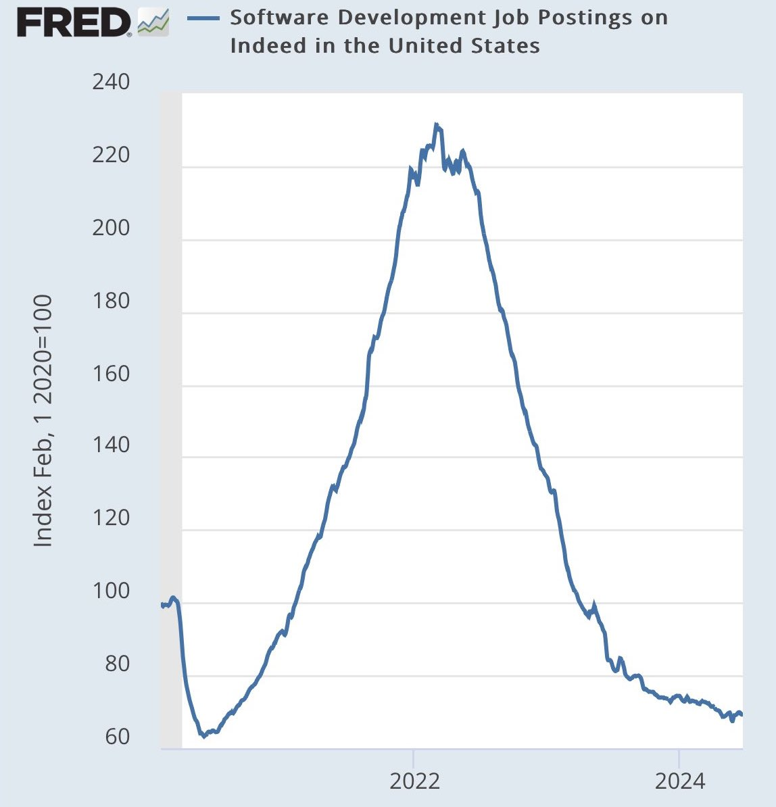

# 2.1. The New Tech Industry

The tech industry has undergone massive changes over the past few years and notably quite a few significant waves of layoffs.

The following is a graph showing new developer postings on Indeed [6]:

Between 2021-2022 we saw a massive spike in new jobs as companies tried to raise headcount to meet newly projected growth.

However, as the world returned to normal, the industry faced mass layoffs and ushered in a period marked by a significant decline in new developer job postings.

## Impact of Mass Layoffs on Young Professionals

As industry giants cut tens of thousands of jobs, many of these displaced workers—often seasoned and highly skilled—shift their focus to smaller tech firms, startups, and mid-sized companies.

Traditionally, smaller companies have been a fertile ground for entry-level opportunities. However, with the influx of experienced professionals seeking new roles, these positions are now being filled by candidates with years of experience, leaving fewer opportunities for recent graduates.

In this period of low developer demand, seasoned professionals are willing to accept lower pay or junior titles to remain employed, further diminishing the chances for new graduates to secure their first job.

Additionally, in a world with so many full-time layoffs, it’s extremely difficult for companies to justify hiring interns.

Internships are often seen as a way to build a pipeline of future talent, but due to economic uncertainty, companies are prioritizing immediate survival over long-term planning.

This further narrows the path for students and recent graduates, who rely on internships as a critical step toward securing full-time employment.

## AI’s Impact on Entry-Level Jobs

The reality is that AI does not fully replace developers—at least, not yet.

Today, AI is simple a tool that saves developers time, kind of like how a calculator saves time in performing complex calculations. According to the 2024 Stack Overflow survey, 81% of developers agree that AI significantly boosts productivity [7].

Although it does not fully replace the duties of an entry level developer, it is able to generate code that could have previously been delegated to interns or new grad level employees.

While AI isn’t replicating the exact work developers do, its ability to enhance efficiency means that if developers become x% more productive with AI, companies may start considering reducing their developer headcount by a similar margin.
