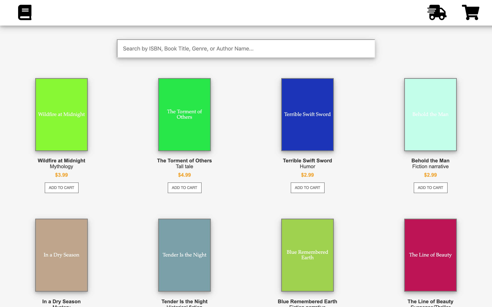
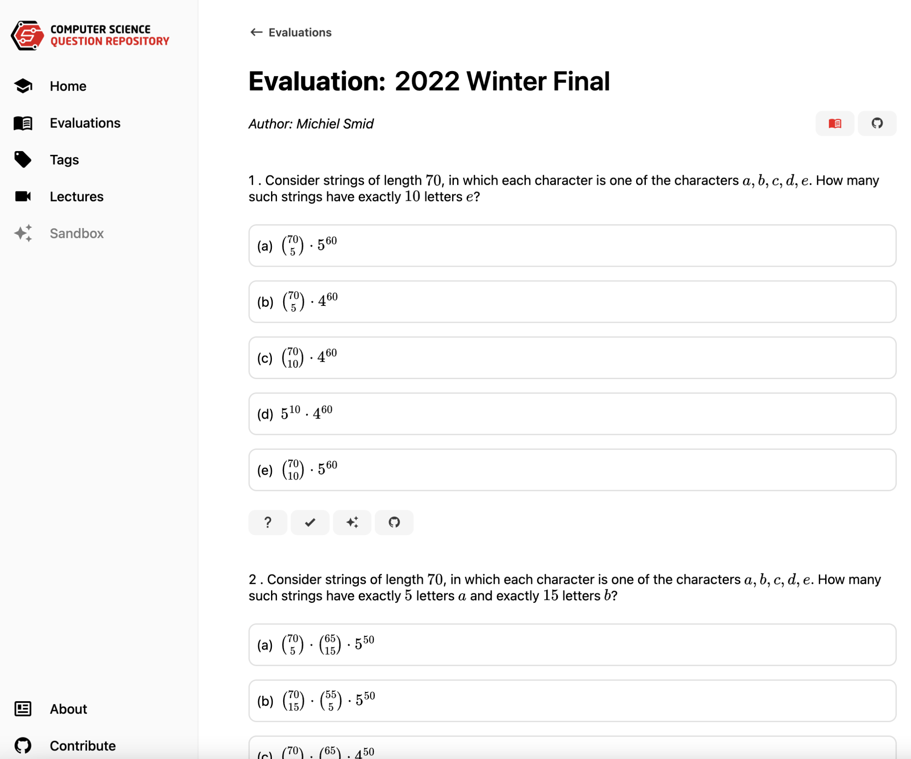

# 3.4. Build Your Portfolio

During your time at university, you’ll work on a number of projects — especially in your upper-year electives, where you often have the freedom to choose what you want to build.

Don’t just see these projects as assignments to complete for a grade. See them as opportunities to grow your portfolio.

Whenever you have the chance to build something, ask yourself:

- Can I use this to learn a new skill or technology?
- Can I turn this into something I’d be proud to show an employer?
- Can I create something that’s useful beyond this course, instead of something I’ll just throw away after?

A lot of students say they don’t have time to build extra projects outside of class. That’s fair — coursework does take time. But if you approach your coursework strategically, you can kill two birds with one stone: fulfill the course requirements _and_ build something that strengthens your portfolio. It actually saves you time in the long run.

(We’ll take a deeper dive into what makes a great project in [Chapter 6.1](../6-gaining-experience-without-formal-employment/1-personal-projects/index.md).

## Personal Examples

Here are a few examples of projects I built at Carleton University where I went beyond the basic requirements and created something valuable for my portfolio:

### Bookstore Application

In my second year, I took a databases course where the final project was to build a simple “Bookstore” app. Most students just made a basic CLI tool that could add, remove, and search books in a database — that’s all you needed to pass.

Instead, I used it as an opportunity to build my first full-stack web app. I chose Golang (which I had never used before) for the backend, React for the frontend, and PostgreSQL for the database. I even tried out Docker and Kubernetes for the first time to deploy it to the cloud.

The code isn’t perfect — but I learned a ton. You can still find it on my GitHub: [MathyouMB/Bookstore](https://github.com/MathyouMB/bookstore).

### Discrete Math Practice App

In my second year, I took a discrete math course where exams were multiple choice. The professor provided practice questions, but flipping between the question PDF and the answer PDF was tedious.

So I built a simple web app to make practicing easier. Over time, I iterated on it, and today it’s been used by **thousands of Carleton students**.

Check out the latest version here: [CarletonComputerScienceSociety/questions](https://github.com/CarletonComputerScienceSociety/questions).

### Microservice Search Engine

In my fourth year, I took a course that involved building a search engine. The assignment only required a single Express.js server that searched pre-indexed data.

But I wanted to challenge myself. I built a microservice architecture with services in Elixir, Python, JavaScript, Ruby, and a Kafka message broker to tie it together.

Did it take more time? Absolutely. Did I get a better grade? Maybe not. But I learned so much more than I would have by taking the simpler route.

You can find the code here: [MathyouMB/comp4601-a1](https://github.com/MathyouMB/comp4601-a1).

