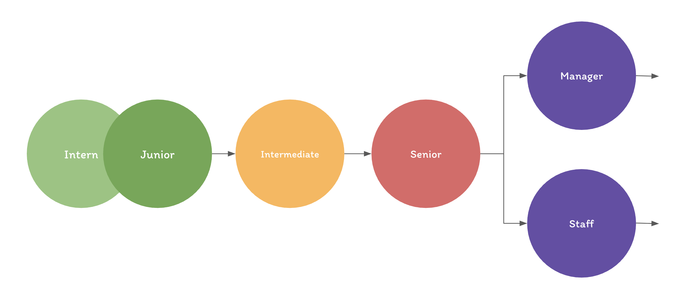

# 4.4. Seniority Levels Explained

In tech, titles like _junior_, _senior_, or _staff engineer_ get thrown around a lot—but what do they really mean?

Most students don't know what is expected of interns and junior developers, making it hard to know how to present themselves effectively to employers and leading to anxiety and imposter syndrome in the workplace.

The following is the most common career ladder in software engineering:

## Apprentice Vs Journeyman

In many fields, you hear terms like **apprentice** and **journeyman** to describe different levels of expertise.

An apprentice is someone who is just beginning their career. They're learning the craft by working under more experienced professionals, often doing small, supervised tasks to build basic skills.

A journeyman is someone who knows how to do the job, but is still gaining depth. They’re not fully experts.

In software engineering, **intern, junior and intermediate** developers are often considered **apprentices**, while **senior** developers are **journeymen**.

I find because the title of "senior developer" has the word "senior" in it, many students assume it means they are expected to be experts. However, the reality is that senior developers are actually the expectation for a journeyman, not an expert.

## Junior Developers

**What it means:**
You're early in your career—either just graduated, in your first or second role, or still learning the ropes.

Junior Developers are often referred to as **entry-level developers**. They are the **Apprentices** of the software engineering world. Junior developers usually have 0-2 years of experience and are still learning the basics of software development.

**What you’re expected to do:**

- Write and debug code under close guidance
- Learn tools, workflows, and team conventions
- Ask a lot of questions and absorb feedback
- Contribute to small features or bug fixes

**What you’re _not_ expected to do:**

- Make architectural decisions
- Independently own large features
- Mentor others

**Goal:**
Grow your skills, gain confidence writing production code, and become a reliable team member.

## Intern Developers

**What it means:**
You are a **junior developer in training.** Meaning your responsibilities and expectations are the same as those of a junior developer, but you are still learning the basics of software development.

You likely have less than a year of experience and may need help with the basics like:

- Learning the corporate workflow
- Knowing how to ask for help
- Understanding the codebase
- Contributing with version control (like Git)

Do not feel bad if you feel like you are not contributing to your team yet. The expectation is that you are still developing the skills to contribute independently, but you’re eager to learn and grow.

## Intermediate Developers

**What it means:**
You’ve got a few years of experience, and you can now work more independently.

As an intermediate developer, you are still considered an **apprentice**. You likely have 1-5 years of experience and are starting to take on more responsibility.

**What you’re expected to do:**

- Own small-to-medium features from start to finish
- Review peers' code and give helpful feedback
- Understand the codebase and how it fits into the product
- Troubleshoot moderately complex issues

**What sets you apart:**
You’re no longer just executing tasks—you’re starting to _make decisions_, raise concerns, and contribute to improving the team’s workflow.

**Goal:**
Build toward being a person others rely on to keep things moving.

## Senior Developer

**What it means:**
You're a technical leader within your team. You have deep knowledge in specific areas and are trusted to solve complex problems.

**What you’re expected to do:**

- Design and implement large features or systems
- Unblock teammates and mentor junior/intermediate devs
- Anticipate edge cases and long-term technical debt
- Make tradeoffs and justify technical decisions

**The real difference:**
You aren’t just _writing code_—you’re helping others succeed, improving systems, and making long-term contributions.

**Goal:**
Lead by example, solve hard problems, and elevate the team.

## Staff Developers and the IC Track

**What it means:**
You’ve advanced beyond the senior level, but you’re still focused on _building_, not managing. Staff, Principal, and Distinguished Engineers all sit on the **Individual Contributor (IC) track**.

**At this level, you might:**

- Set technical direction across multiple teams
- Lead architectural reviews and system redesigns
- Act as a go-to expert for critical areas
- Influence company-wide engineering practices

**You're valued for:**
Your technical depth, judgment, and ability to solve _organization-level_ problems—not just team-level ones.

**Goal:**
Scale your impact through deep expertise, long-term thinking, and technical leadership.

## Engineering Managers and the Management Track

**What it means:**
Instead of advancing through technical depth, you’ve chosen to lead _people_.

**Engineering managers:**

- Run 1-on-1s, performance reviews, and hiring
- Remove roadblocks for their team
- Align team priorities with company goals
- Foster growth and well-being of their developers

At higher levels, the track continues to **Director → VP**, with increasing responsibility over teams, departments, and strategic decisions.

**Important note:**
Management is not “above” senior or staff developers. It’s a _parallel_ track. Some senior engineers choose to stay technical; others become managers.

**Goal:**
Help your team thrive and deliver great software by building a healthy, productive environment.
